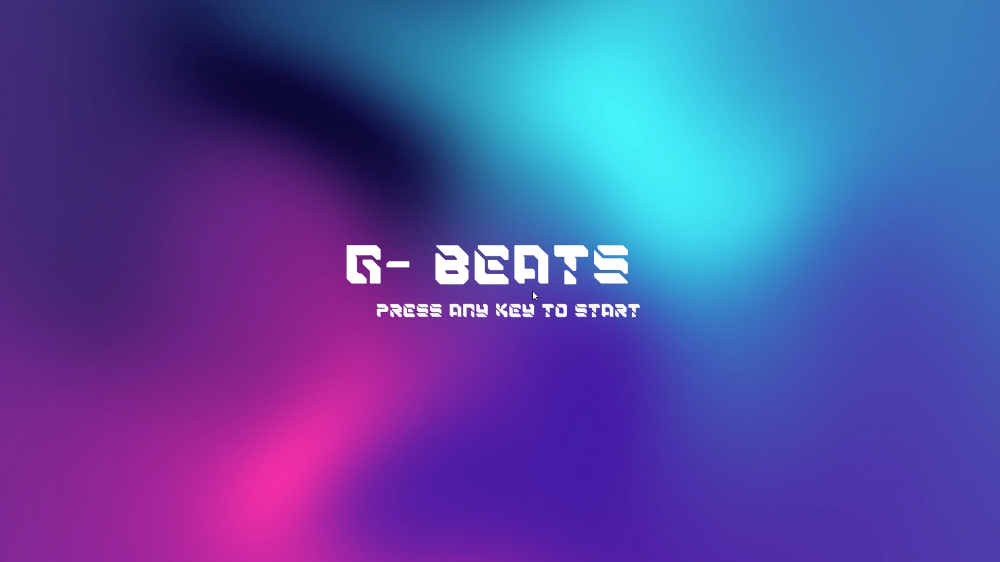

# G-Beats(Gesture-Beats) – 손가락 입력 기반 리듬게임 (Unity + FMOD + Python)

## 개요
G-Beats는 Python Mediapipe를 활용한 손가락 입력 감지와 Unity/FMOD 기반의 음악 연동 판정 시스템이 결합된 리듬게임입니다.  
곡 선택 → 곡 미리듣기 → 실시간 입력 판정까지 하나의 흐름으로 작동하며, 키보드 또는 손 제스처로 플레이할 수 있습니다.

오락실에서 즐기던 리듬게임들의 감성을 재현하고 싶었습니다.  
하지만 단순한 복제보다는 손 제스처라는 새로운 입력 방식으로, 물리적인 컨트롤러 없이도 직관적이고 몰입감 있는 리듬게임을 구현해보고자 하였습니다.

- 장르: 2D 리듬게임 (곡 선택 + 실시간 판정)
- 개발 기간: 2025.04 ~ 2025.06
- 개발 형태: 개인 프로젝트
- 지원 플랫폼: Windows PC

## 사용 기술

| 분야           | 기술 및 도구                                   |
|----------------|------------------------------------------------|
| 게임 엔진      | Unity 2022.3 (C# 기반)                         |
| 오디오 관리    | FMOD Studio + FMODUnity                        |
| 입력 인식      | Python 3 + Mediapipe                           |
| 통신 방식      | TCP Socket (Python ↔ Unity)                    |
| 리소스 관리    | StreamingAssets 폴더 기반 mp3 및 이벤트 로딩  |
| 영상 스트리밍  | Python → Unity 실시간 RawImage 수신 처리      |

## 주요 기능

- 곡 선택 화면: 곡 목록 순환, 미리듣기 기능 포함
- 입력 방식 선택 가능: 키보드(DFJK) 또는 손 제스처 입력
- 정확도 기반 판정 시스템: Perfect / Good / Miss
- 난이도별 노트 자동 생성: SuperEasy ~ Hard
- 손 제스처 기반 입력: 주먹, OK 사인 등으로 곡 선택 및 노트 입력 가능
- Python 영상 송출 서버와 Unity 간 실시간 영상 렌더링 연동
- 빌드 후에도 StreamingAssets 포함 자동 설정으로 외부 mp3 동작 보장

## 플레이 방법

| 입력 | 설명 |
|------|------|
| A / D 키 또는 왼손 / 오른손 쥐기 | 곡 선택 회전 |
| Enter 키 또는 손가락 OK 사인 | 선택된 곡 플레이 |
| D / F / J / K 키 또는 해당 박스 위에서 손 쥐기 | 노트 입력 (4레인) |
| ESC | 씬 이동 또는 종료 |

## 프로젝트 구조 (요약)

```
G-Beats/
├─ Songs/             # mp3 및 FMOD Event 기반 경로
├─ PythonCode/        # cam_SongSelect.py / cam_GamePlay.py
├─ StreamingAssets/   # 자동 포함된 오디오 리소스
├─ G-Beats.exe        # 빌드된 게임 실행 파일
├─ README.md
```

## 코드 구조 및 핵심 시스템

### Unity 주요 스크립트

| 파일 | 설명 |
|------|------|
| AudioManager.cs | FMOD 이벤트 재생 및 정지, 음악 길이 제공 |
| NoteManager.cs | 난이도 기반 노트 생성 및 실시간 스폰 |
| NoteJudger.cs | 노트 타이밍 판정 (Perfect / Good / Miss) |
| NoteMover.cs | 노트가 지정된 traveltime을 기준으로 하강 |
| InputHandler.cs | 키 입력 및 애니메이션 트리거 제어 |
| ImageReceiver_*.cs | Python에서 영상 수신 및 Sprite 생성 |
| SelectSong.cs | 곡 선택 UI 회전, 미리듣기, 곡 전환 처리 |
| PythonLauncher_*.cs | Python Mediapipe 서버 실행 및 종료 |
| AnimationManager.cs | 판정에 따른 이펙트 및 트랙 글로우 재생 |

### Python Mediapipe 시스템

| 파일 | 역할 |
|------|------|
| cam_GamePlay.py | 손가락 위치 + 주먹 여부로 DFJK 입력 시뮬레이션 |
| cam_SongSelect.py | 왼손/오른손 주먹으로 A/D, OK 사인으로 Enter 처리 |
| pyautogui | 손 제스처를 Unity가 인식 가능한 키 입력으로 변환 |
| OpenCV + Socket | 실시간 PNG 영상을 Unity로 전송 |


### 인식 제스처 종류 (Mediapipe 기반 입력 시스템)

#### 1. 주먹 (Fist)

- **정의**: 손가락 끝(tip)이 해당 손가락의 두 번째 관절(PIP)보다 아래(Y 값이 더 큼)인 경우 해당 손가락이 접힌 것으로 간주
- **판별 조건**:
  - 검지(8), 중지(12), 약지(16), 새끼손가락(20) 중 3개 이상 접힘 → 주먹
- **기능**:
  - `곡 선택 화면`:  
    - 왼손 주먹 → 곡을 왼쪽으로 회전 (A 입력)
    - 오른손 주먹 → 곡을 오른쪽으로 회전 (D 입력)
  - `게임 플레이 화면`:  
    - 특정 입력 박스 영역 안에서 주먹 → 해당 레인(DFJK) 키 입력으로 간주

#### 2. OK 사인

- **정의**: 엄지와 검지 끝의 유클리드 거리(`distance(thumb_tip, index_tip)`)가 0.05 미만일 경우
- **기능**:
  - `곡 선택 확정 (Enter)`에 사용됨
  - OK 사인이 감지되면 곡 미리듣기를 정지하고 게임 씬으로 전환

#### 3. 박스 내 손 위치 감지

- **정의**: 손가락 랜드마크 중 하나라도 특정 위치 박스(`create_keyboxes()` 함수로 정의된 위치) 내부에 존재하는 경우
- **조건**:
  - 손가락이 박스 안에 있고, 동시에 주먹 상태일 때만 유효 입력으로 인정
- **기능**:
  - `게임 플레이`: 해당 박스에 대응되는 DFJK 키가 눌린 것으로 간주되어 노트 판정 시스템(`NoteJudger`)에 입력 전달


#### 추가 설명

- 제스처는 `Mediapipe.Hands`가 반환하는 `multi_hand_landmarks` 리스트에서 실시간으로 추출되며,
- Python 내에서 처리된 입력은 `pyautogui.keyDown()/keyUp()`을 통해 Unity 측에 가상 키 입력으로 전달됩니다.
- Unity에서는 일반적인 키보드 입력과 동일하게 처리되어 판정/선택 로직에 통합됩니다.


## 실행 환경


1. **Python**
   - Python 3.10 버전 이상

2. **필요한 라이브러리**
```bash
   pip install mediapipe
   pip install opencv-python
   pip install pyautogui

```
### 향후 개선 및 추가하고 싶은 기능

| 개선 항목 | 설명 |
|-----------|------|
| 난이도 선택 UI 추가 | 현재는 내부 enum으로 난이도를 설정하므로, 유저가 직접 선택할 수 있는 UI가 필요함 |
| 게임 결과 화면(Scene) 추가 | 판정 수(Perfect/Good/Miss), 정확도, 콤보 등 플레이 결과를 정리하여 시각적으로 보여주는 화면 |
| 콤보 시스템 | 연속된 정확한 입력에 따른 콤보 표시 및 시각 효과 추가 |
| 스코어 계산 시스템 | 각 판정에 따른 점수 누적 및 최고 점수 저장 기능 |
| 곡별 BPM 자동 인식 또는 JSON 기반 설정 | 현재는 고정 BPM으로 설정되어 있어, 다양한 곡에 대응하려면 외부 설정이 필요 |
| 키 리매핑 기능 | 유저가 원하는 키로 DFJK 매핑을 변경할 수 있는 옵션 UI

## 추가 정보

- 플레이 영상: ((https://youtu.be/0kk4giHEHhI))
- Python 코드 설명: PythonCode 폴더 내 주석 참조
- FMOD 이벤트 경로: event:/Songs/Track0 ~ Track9
